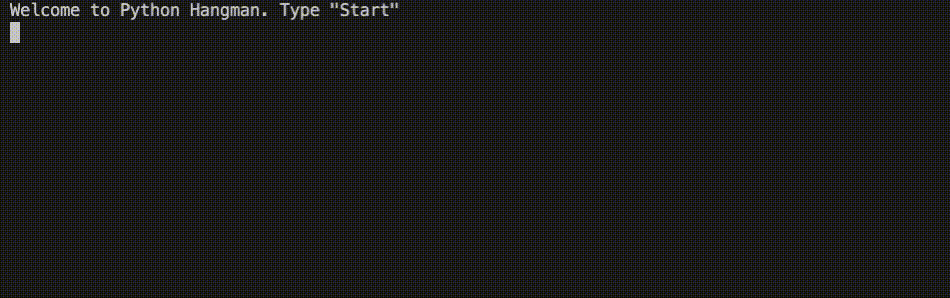

# Hangman

**Premise**
For this project, you'll create a hangman game. The script needs to randomly select a word from an imported dictionary of English words, and provide the player a means of guessing the letters in the selected word
ignore case and words that do not contain all alphabets, count the frequencies, and ignore uninteresting or irrelevant 

**Language**
Python

### Below is an example of the word cloud generated from the selected text

---
---
## Below are the installs and imports needed for the hangman script

```
!pip install wordcloud
!pip install fileupload
!pip install ipywidgets
!jupyter nbextension install --py --user fileupload
!jupyter nbextension enable --py fileupload

import wordcloud
import numpy as np
from matplotlib import pyplot as plt
from IPython.display import display
import fileupload
import io
import sys
```

## Below is code for the the uploader widget

```
def _upload():

    _upload_widget = fileupload.FileUploadWidget()

    def _cb(change):
        global file_contents
        decoded = io.StringIO(change['owner'].data.decode('utf-8'))
        filename = change['owner'].filename
        print('Uploaded `{}` ({:.2f} kB)'.format(
            filename, len(decoded.read()) / 2 **10))
        file_contents = decoded.getvalue()

    _upload_widget.observe(_cb, names='data')
    display(_upload_widget)

_upload()
```
The text used for the word cloud displayed below is the **Vassals of the Lode-Star by Gardner F. Fox**
The text was found through **The Project Gutenberg**

## Below is a function that iterates through the uploaded file, removes punctuation, and counts the frequency of each word. The function will ignore any word that does not contain only letters, as well as overly utilized words like "and" or "the"

```
def calculate_frequencies(file_contents):
    
    # Here is a list of punctuations and over-utilized words that will be filtered from the text

    punctuations = '''!()-[]{};:'"\,<>./?@#$%^&*_~'''

    uninteresting_words = ["the", "a", "to", "if", "is", "it", "of", "and", "or", "an", "as", "i", "me", "my", \
    "we", "our", "ours", "you", "your", "yours", "he", "she", "him", "his", "her", "hers", "its", "they", "them", \
    "their", "what", "which", "who", "whom", "this", "that", "am", "are", "was", "were", "be", "been", "being", \
    "have", "has", "had", "do", "does", "did", "but", "at", "by", "with", "from", "here", "when", "where", "how", \
    "all", "any", "both", "each", "few", "more", "some", "such", "no", "nor", "too", "very", "can", "will", "just"]
    
    # List Comprehension will be used to filter out punctuation and over-utilized words found in the above lists

    ```
    word_list = file_contents.split(' ')

    words = [word for word in word_list if uninteresting_words.count(word.lower()) == 0]

    words_no_punct = [word for word in words if word.isalpha()]
    ```

    ## A dictionary will be used as a frequency table to catalog word repetition

    ```
    word_freq = {}
    
    for word in words_no_punct:
        if word.lower() in word_freq:
            word_freq[word.lower()] += 1
        else: 
            word_freq[word.lower()] = 1
    ```
    ## Below are the methods used by wordcloud
    
    ```
    cloud = wordcloud.WordCloud()
    cloud.generate_from_frequencies(word_freq)
    return cloud.to_array()
    ```
    
# Used to display the wordcloud image

myimage = calculate_frequencies(file_contents)
plt.imshow(myimage, interpolation = 'nearest')
plt.axis('off')
plt.show()
```
---
---

